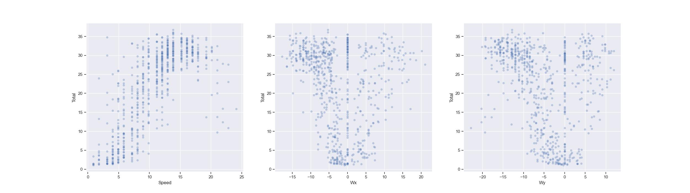

## Intro
My project can be divided into the following stages:

1. Getting the data from DB 
2. Preprocessing
3. Model training
4. Choosing the best model and predicting future power production

Each of these stages will be now discussed more in detail in the below sections.

## Detailed look at each stage

### Getting the data from DB 
In this stage, I used the code given in `template.py` to get the following two
datasets: 

1. Weather data
2. Power production data

and store them as `pandas dataframe`. In a similar fashion, I also retrieved the
future weather data.

### Preprocessing
In this stage, I identified the following challenges to be addressed for both
datasets:

1. Checking in both datasets for missing values
2. Getting rid of columns that are not used

The first point is solved by simply dropping rows with missing values. I decided
to do so as there has never been any missing values. However, possibly I could
implement an alert which would send me for example an email notification when
the number of dropped rows would exceeds a certain threshold. The second point is
self - explanatory as it does not make sense to keep columns which are not used
in memory. 

In addition to the above steps, for weather dataset, I had to address the
following:

1. Turn the direction of the wind into a quantitative feature
2. Consider the number of lead hours for given forecast

For the first point, I followed the following [tutorial](https://www.tensorflow.org/tutorials/structured_data/time_series#wind) which shows how to turn the wind direction given in `degrees` to a `wind vector` which has two components `Wx` and `Wy`. Before I could follow the tutorial I had to figure out how to turn the direction given as a string to corresponding degree. Of course one of the possible ways would be to manually define dictionary which would map the string values to the corresponding degree. However, I wanted to find a more robust method which I found on [Stackoverflow](Https://codegolf.stackexchange.com/questions/54755/convert-a-point-of-the-compass-to-degree).

For the second problem, I did initial EDA and found out that when it comes to
past weather forecast, there are only records with lead hours equal to 1.
Therefore, I made an assumption that it will be this way all the time and thus
filter out records whose lead hours cell is greater than 1 to ensure that there
are no duplicates for a certain time. Again, I could possibly set an alert which would inform me when this assumption might not hold any longer. On the other hand, naturally for the future weather forecasts, it did not make sense to apply such filter. Further, this approach leads to unnecessary loss of data and it might be desirable for the model to take into account the lead hours as well. Despite that, my philosophy here was that I want my model to be trained on the most precise data.

Last but not the least, I had to decide how I am going to align the two datasets
since weather dataset included records `3 hours` from each other whereas the
power dataset records were sampled `every minute`. Essentially, the options
could be summarized as follows:

1. Use only records from power dataset which match the time in weather dataset
2. Perform aggregation of power dataset by grouping records into 3 hours
   intervals and use some summary metric on power production

Intuitively, I believe that the first option makes more sense as I want the
model to know what is the precise power production given some weather data for
that particular time. On the other hand, we might assume that given weather
conditions might be very similar within the 3 hours interval and as such it
might make more sense to go for the second option. For this reason, I decided to
implement both and empirically compare the results.

To implement the second option, I decided to use pandas
`resample` method:

```py
df = df.resample('180min', on='time').mean().interpolate(method='linear')
```

As can be seen from the above code snippet, I grouped power records into 3 hours
intervals and then used `mean` to obtain mean generated power within the given
3 hours interval. After doing so, I found out that there are also `NaN` in the
aggregated dataset, which simply means that within the given 3 hours window
there were no power data. To solve this issue, I used `linear interpolation` which is
a way of replacing missing values by assuming that the values are equally
spaced. A practical example can be found in [pandas docs](https://pandas.pydata.org/docs/reference/api/pandas.DataFrame.interpolate.html).

Alternatively, I could just drop the corresponding rows, but I did not want to
lose additional data. Finally, once this has been done, I used inner join to merge the two datasets:

```py
df = weather.merge(power, on="time", how="inner")
```

Note that to implement the first option, I simply ignored the `resampling` step. After the merged, I printed the following information summarizing the merge (this corresponds to the second option):

```py
> merged done successfully:
  >> Weather df shape: 717 x 5
  >> Power df shape:   721 x 1
  >> Merged df shape:  717 x 6
```

Based on empirical evidence, I concluded that the first option is better.

### Model training
Before, I dived into model training, I tried to visualize the relationship
between the `power production` and corresponding independent variable such as
speed, this can be seen on the figure below:



Clearly, the relationships are `non-linear` which means that the selected models
should be able to capture this complexity.

I decided to train the models using `cross validation`, therefore I only split the
data into `training` and `test`:

```py
y = df[target].to_numpy()
X = df.loc[:, df.columns.isin(FEATURES)].to_numpy()
X_train, X_test, y_train, y_test = train_test_split(X, y, test_size=0.2, shuffle=False)
```

In the above code snippet, you can also see that before the actual split,
I extract the power production column and save it as a numpy array. Similarly,
I extract relevant columns which represent features. My final choice was to only
use `Speed` as a feature. The reason why I did not decide to include `wind vector` as a feature is that
I actually got worse results. This shows two things:

- Since the feature space is larger, it is easier to overfit due to `curse of
  dimensionality` and thus cross validated results get worse

- I tried to have as features only the wind vector and got cross validated `R2 ~ 0.4` compare to
  the model trained only on speed `R2 ~ 0.6` (for FFNN). My interpretation of
  this is that wind vector is capable of giving a good indication of power
  production, but when combined with speed, it does not add any significant
  additional information which would lead to better results 

Further, I already mentioned the reason why I decided NOT to use `Lead_hours`. I ended
up not using `Time` because I believe it does not play an important role compare
to other features. On the other hand, I believe it might be at least worth trying.

Once I obtained training and test data, I decided to use the following three
models: Linear regression with polynomial features (`LR`), Decision Tree (`DT`), Feed forward neural network  (`FFNN`). I listed them in the increasing order of complexity, where `LR` should serve me as a good baseline, whereas `FFNN` requires more time to train, but would expect better results from it in return. For each of these models, I then used `Grid search` to obtain the most optimal hyper parameters. Here is for example how `FFNN` was trained:

```py
pipe = make_pipeline(
    StandardScaler(),
    MLPRegressor(random_state=42, shuffle=False)
    )

params = {
    "mlpregressor__hidden_layer_sizes": [[25, 30], [10, 15]],
    "mlpregressor__activation": ['relu', 'tanh'],
    "mlpregressor__learning_rate_init": [.01, .001, .0001, 0.00001],
    "mlpregressor__max_iter": [400, 600]
}

grid = GridSearchCV(pipe, param_grid=params, scoring='r2', cv=TimeSeriesSplit(5), verbose=-1)

grid.fit(X_train, y_train)
```

In a similar fashion, I trained the other models. I then used the model with the best cross validated `R2` score which as expected was `FNNN`:

```
[Comparing models' best cross validated scores]

> Name: Linear regression
> R2: 0.6091809162158869

> Name: Decision tree
> R2: 0.5983677449969956

> Name: Neural network
> R2: 0.6173646475440021
```

I decided to use the `R2` score for the following reasons:

- It is easily interpretable
- One can easily use it to compare different models
- It takes into account mean squared error which emphasizes large errors more

Alternatively, I might choose a different method if I knew what are the
business objectives.

### Choosing the best model and predicting future power production
In this final stage, I had to decide which of the following models is better
based on their performance on test data set:

1. The best previous model
2. The current model achieving the best cross validated score

I decided to use the test dataset from the most recent data as my goal is to
find out which of the two models is capable of predicting the most recent
future. Again, the key scoring metric was `R2`:

```
[Performance of the latest old model on test set]
> R2: 0.7801291121068283

[Performance of the new model on test set]
> R2: 0.7801291121068283
```

After choosing the best model,
I preprocessed the future weather data in a similar fashion as it was described in the above section. Using the best model, I then predicted future power production and saved it along with the best model.


## Further improvements and considerations

In this section, I would like to address possible further improvements of the
pipeline as well as considerations that I have not mentioned in the previous
sections.

### Features
As a possible future improvement, I might consider transforming time column into
a usable feature such as by translating the `datetime` value into a `timestamp`.
Another improvement could be made by adding a `feature selector` to the pipeline
such as [recursive feature elimination](https://scikit-learn.org/stable/modules/generated/sklearn.feature_selection.RFE.html#sklearn.feature_selection.RFE). 

### Models
Since we are dealing with time series data, it might be beneficial to use
a model which is capable of taking the previous state (timewise) into account.
An example of such model might be [LSTM](https://pytorch.org/docs/stable/generated/torch.nn.LSTM.html).

### More data
One might also consider taking into account more historic data instead of just
`90 days`. I tried to use `180 days` to determine what might be an optimal
interval and my `R2` performance improved slightly. On the other hand, it is
important to note that feeding in more data does necessarily need to translate
into a better performance since the new data might not add any new patterns to
be learned. In addition, in the context of time series, it is also important
consider that we might not want the model to learn patterns that happened
a while ago.

